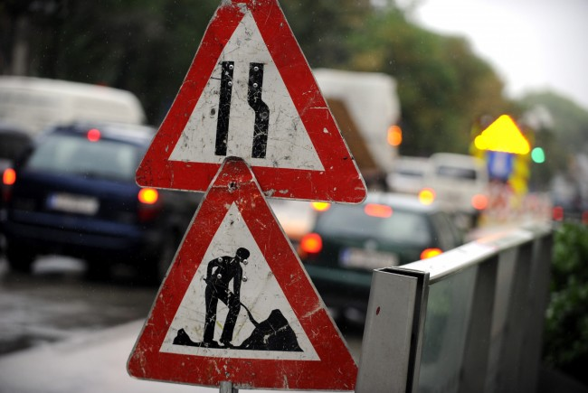

# **Traffic Sign Recognition** 

### Data Set Summary & Exploration

I used the python/numpy to calculate summary statistics of the traffic
signs data set:

Training set is 
* The size of training set is 34799 samples
* The size of the validation set is 4410 samples
* The size of test set is 12630 samples 
* The shape of a traffic sign image is 32x32
* The number of unique classes/labels in the data set is 43

#### 2. Exploratory visualization of the dataset.

Here is an exploratory visualization of the data set. It is a bar chart showing how the data is distributed among all categories for training, validation and test set. 


Training data  
  
Validation data  
  
Test data  

Sample images
 

### Design and Test a Model Architecture

#### 1. Data sampling, preparation and augmentation

In folder "previous steps" you can check steps I took to get to this point with model/data.

I found out that dataset is highly unbalanced - some categories were 20 times larger than the others. This is why I decided to upsample smaller categories so that all categories would have the same number of elements. At this point I didn't augment images themselves. My idea was to do it later in the next steps.

Dataset after upsampling all categories to have the same amount of examples as the largest one:


#### 2. Data preparation

I decided not to go black and white because I didn't want to lose any information. I noticed that many of road signs were really low contrast, very dark and some were pretty blurry, so I tried techniques like:
- simple brightness change
- advanced gamma correction
- CLAHE (histogram equalization) 

My idea was - if something is almost unreadable to human being, neural network can also have hard time recognizing it. Therefore I inspected every idea i had with my eyes first and then tested it on neural network. 

Based on preliminary tests/results I went with "CLAHE" histogram equalization. Later I also tested further brightness changes, but witn no significant change in accuracy. 

Next step was of course division by 255 (normalizing to 0-1) and subtracting 0.5 to "center" the data around 0. 


#### 3. Data augmentation

After geting to around 97% accuracy, I decided to tried to test couple of data augmentation techniques like random shifts, scaling, brightness change. Scaling gave some real boost in results.
You can see it in 

Examples of data augmentation:
Blur change

Brightness change

Scale change

Shift change


#### 2. Model description

I started with simple lenet as in previous lab, then made it wider/deeper. After couple of tests I switched to vgg-like architecture. 


My final model consisted of the following layers:

| Layer         		|     Description	        	| 
|:---------------------:|:---------------------------------------------:| 
| Input         		| 32x32x3 RGB image   			| 
| Convolution 5x5     	| 1x1 stride, same padding, outputs 32x32x64 	|
| RELU			|						|
| Convolution 5x5     	| 1x1 stride, same padding, outputs 32x32x64 	|
| RELU			|						|
| Max pooling	      	| 2x2 stride,  outputs 16x16x64 		|
| Convolution 3x3     	| 1x1 stride, same padding, outputs 16x16x128 	|
| RELU			|						|
| Convolution 3x3     	| 1x1 stride, same padding, outputs 16x16x128 	|
| RELU			|						|
| Max pooling	      	| 2x2 stride,  outputs 8x8x64 		|
| Fully connected		| in:8192 / out:120        									|
| Dropout| keep_rate =  0.7 etc.        									|
| Fully connected		| in:120 / out:43       									|
| Softmax				| etc.        									|
|						|												|
|						|												|
 


#### 3. Training 
Based on couple of docker files found on the web, i created my own - tf (gpu based) + cv + some libraries.
Anyone can build it (couple of hours) at home - [Dockerfile](Dockerfile)  
I trained my model with "Adam" optimizer and learning rate of 0.001.
Most of the tests were done in range 15-25 epochs, after that i berely saw any change in validation accuracy. 
For most of the tests I used dropout keep_rate at 0.7

#### 4. Final results
To get to 97.5% i went through several steps:
1) Lenet architecture with more filters
2) Prepared data histogram / labels / quantity for each category
3) Tested filters 3x3 against 5x5. Suprisingly 5x5 gave much better results. Probably due to very little tiny features on road signs
4) Added data normalization x/255
5) Tested x -= mean(x) and x /= stddev(x) - worse results
6) Tested min/max regularization - worse results
7) Switched to "vgg like" network 
8) Tested 3x3 filters in third and fourth layer - better results
9) Smaller categories upsampling - 95% accuracy
10) Gamma adjust - 96%
11) Switch to CLAHE - 97% and fixed dropout (turned off) during prediction
12) Displaying more examples, testing brightness correction - issues with rgb images overflow (values higher than 255)
13) Switch to python generator (instead a simple loop)
14) Testing data augmentation 
- small image shifts (0-4 px)
- directional blur
- resizing
- brightness change


I changed training code, so every epoch it is testing model against training data as well. This gives me knowledge about overfitting and convergence in general (if it works at all). 
I also added saving best model possible - during training code remembers last best accuracy, and if new one (in the new epoch) is better - it saves model again. It slowed down training process, but gave better results in test accuracy. 
To augment batches in "real time" - i switched to python generator, so augmentation is applied per batch. Less issues with memory limits, but slower solution. One could try to use some parallel processing here - it could speed things up.  
I used dropout between fully connected layers to help model generalize better (avoid overfitting). 

```
best_accuracy = 0
proper_generator = batch_generator()
with tf.Session() as sess:
    sess.run(tf.global_variables_initializer())
    num_examples = len(X_train)
    
    print("Training...")
    print()
    for i in range(EPOCHS):
        X_train, y_train = shuffle(X_train, y_train)
        for offset in tqdm(range(0, num_examples, BATCH_SIZE)):
            
            batch_x, batch_y = next(proper_generator)
            sess.run(training_operation, feed_dict={x: batch_x, y: batch_y, keep_prob : 0.7})
        
        proper_generator = batch_generator()
        training_accuracy = evaluate(X_train, y_train)
        validation_accuracy = evaluate(X_valid, y_valid)
        
        # saving best model possible
        if validation_accuracy > best_accuracy:
            best_accuracy = validation_accuracy
            saver.save(sess, './lenet')
            print("Model saved")
        
        print("EPOCH {} ...".format(i+1))
        print("Train Accuracy (no augmentation, only prep)= {:.4f}".format(training_accuracy))
        print("Validation Accuracy (no augmentation, only prep)= {:.4f}".format(validation_accuracy))
        print()
```    


My final model results were:
* training set accuracy of 99.9%
* validation set accuracy of 98.5%
* test set accuracy of 97%


### Testing my model on new images

#### 1. A few german trafic signs found on the web:

Here are a few German traffic signs that I found on the web:

  
  
  
  
  
  
  
  
  
  
  
  
I cropped them before testing on my model.
Some of them could be harder because of partial oclusions, blurriness or dirt.
I will resize them to 32x32 in code.

  
 
 
 
  


<br /><br /><br />  
#### 2. Testing german road signs in my model

Here are the results of the prediction:

| Image			        |     Prediction	        					| 
|:---------------------:|:---------------------------------------------:| 
| 60      		| Speed limit (60km/h) 									| 
| Dangerous curve to the left      		| Dangerous curve to the left							| 
| Road work     			|  Road work 										|
| Road work   		| Road work        							|
| Road narrows on the left   		| Road work        							|
| No vehicles			| Roundabout mandatory     							|
| 40					| Speed limit (80km/h)									|
| Road work    		| Road work   			 				|
| Pedestrians			| Speed limit (30km/h)      							|
| Pedestrians			| Priority road      							|
| Roundabout			| Priority road     							|
| Blind alley		| No passing     							|
| Bicycles			| No entry     							|


The model was able to correctly guess 5 of the 13 traffic signs, but some of them were completely unknown to the model. I just wanted to see, what happens. 

#### 3. Top 5 probabilites

The code for making predictions on my final model is "Test German Road Signs" cell. 


| category			        |     probability	        					| 
|:---------------------:|:---------------------------------------------:| 
| Speed limit (60km/h)    		| 1.0000 									| 
| Keep right    		| 0.0000 									| 
| Go straight or right    		| 0.0000 									| 
| End of speed limit (80km/h)  		| 0.0000 									| 
| Speed limit (80km/h)  		| 0.0000 									| 


| category			        |     probability	        					| 
|:---------------------:|:---------------------------------------------:| 
| Dangerous curve to the left   		| 1.0000 									| 
| Road narrows on the right    		| 0.0000 									| 
| Speed limit (70km/h)  		| 0.0000 									| 
| Double curve 		| 0.0000 									| 
| Speed limit (120km/h) 		| 0.0000 									| 


| category			        |     probability	        					| 
|:---------------------:|:---------------------------------------------:| 
| Road work  		| 1.0000 									| 
| Priority road  		| 0.0000 									| 
|  Traffic signals 	| 0.0000 									| 
| Speed limit (80km/h)		| 0.0000 									| 
| Bumpy road		| 0.0000 									| 

./german_examples/cut/2a.jpg


| category			        |     probability	        					| 
|:---------------------:|:---------------------------------------------:| 
| Road work  		| 1.0000 									| 
| Priority road  		| 0.0000 									| 
|  Traffic signals 	| 0.0000 									| 
| Turn left ahead	| 0.0000 									| 
| Yield	| 0.0000 									| 


| category			        |     probability	        					| 
|:---------------------:|:---------------------------------------------:| 
| Road work  		| 1.0000 									| 
| Keep right 		| 0.0000 									| 
|  General caution 	| 0.0000 									| 
|  Priority road 	| 0.0000 									| 
|  Keep left | 0.0000 									| 


Roundabout mandatory

| category			        |     probability	        					| 
|:---------------------:|:---------------------------------------------:| 
| Road work  		| 1.0000 									| 
| Keep right 		| 0.2691									| 
|  General caution 	| 0.0053								| 
|  Priority road 	|0.0015							| 
|  Keep left | 0.0013 									| 


| category			        |     probability	        					| 
|:---------------------:|:---------------------------------------------:| 
| Speed limit (80km/h)  		| 0.9997 									| 
| Speed limit (60km/h)		| 0.0003						| 
|    End of speed limit (80km/h)	| 0.0000							| 
|  Speed limit (30km/h) 	|0.0000			| 
| Vehicles over 3.5 metric tons prohibited  | 0.0000		| 


| category			        |     probability	        					| 
|:---------------------:|:---------------------------------------------:| 
|  Road work   		| 1.0000			| 
| Traffic signals		| 0.0000						| 
|  Priority road	| 0.0000							| 
|   Yield 	|0.0000			| 
| Turn left ahead  | 0.0000		| 


| category			        |     probability	        					| 
|:---------------------:|:---------------------------------------------:| 
|  Speed limit (30km/h)  		| 0.9290			| 
| No entry		| 0.0354					| 
|  Speed limit (20km/h)	| 0.0098						| 
|    Traffic signals |0.0086		| 
|  Stop | 0.0084		| 


| category			        |     probability	        					| 
|:---------------------:|:---------------------------------------------:| 
|  Priority road 		| 0.9796			| 
|  No passing 		| 0.0095					| 
|  End of no passing	| 0.0055				| 
|     No entry |0.0031 | 
|    Dangerous curve to the right | 0.0013		| 


| category			        |     probability	        					| 
|:---------------------:|:---------------------------------------------:| 
|   Priority road	| 0.9993	| 
|  Road work 		| 0.0007			| 
|  Yield	|  0.0000		| 
|     Traffic signals |0.0000| 
|     Stop | 0.0000		| 


| category			        |     probability	        					| 
|:---------------------:|:---------------------------------------------:| 
|   No passing	| 0.9806 | 
|  Priority road 		| 0.0188		| 
|  Vehicles over 3.5 metric tons prohibited	|  0.0002		| 
|     Yield  |0.0001| 
|     No passing for vehicles over 3.5 metric ton | 0.0001		| 


| category			        |     probability	        					| 
|:---------------------:|:---------------------------------------------:| 
|   No entry	| 0.8884	| 
|   Stop		| 0.1116			| 
|   Speed limit (20km/h)	|  0.0000		| 
|     Speed limit (30km/h)  |0.0000| 
|     Speed limit (80km/h) | 0.0000		| 


