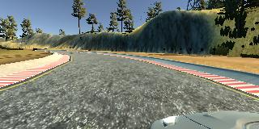
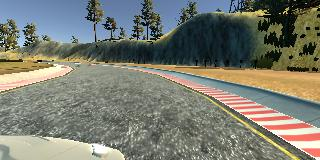
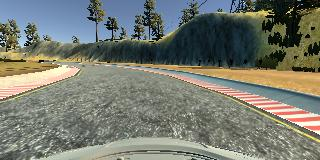
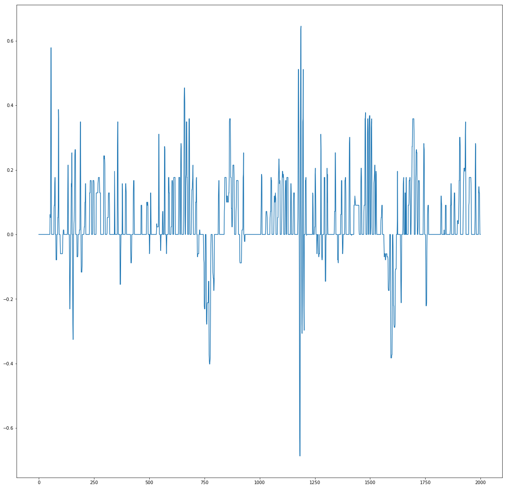
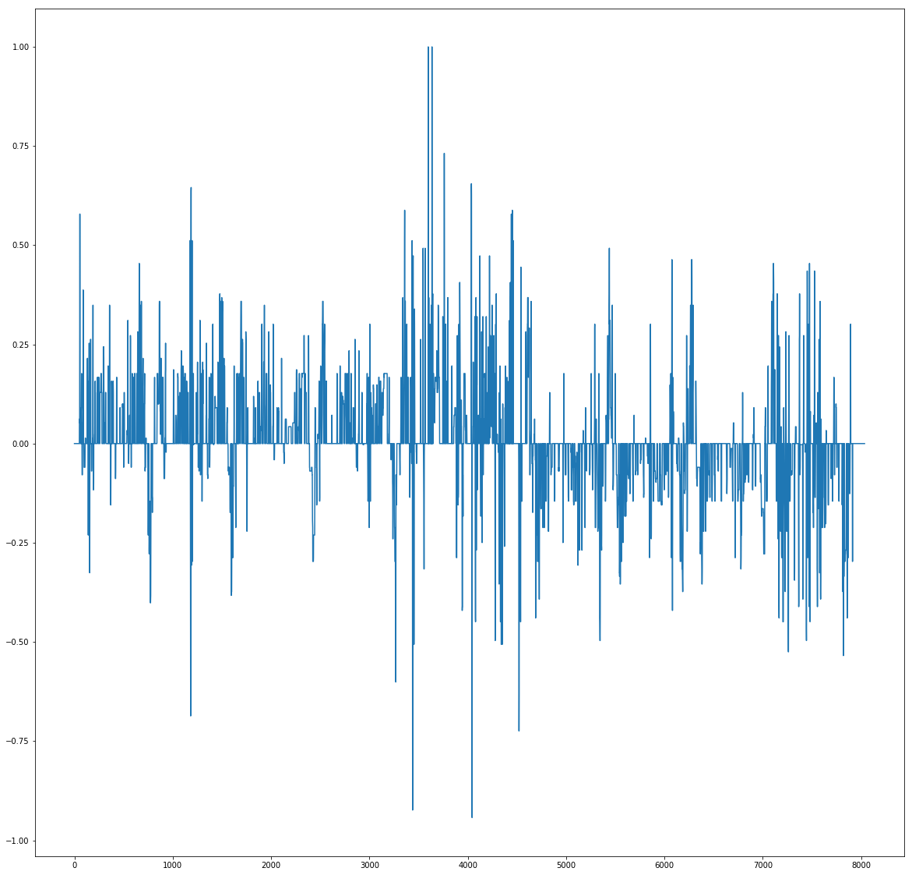
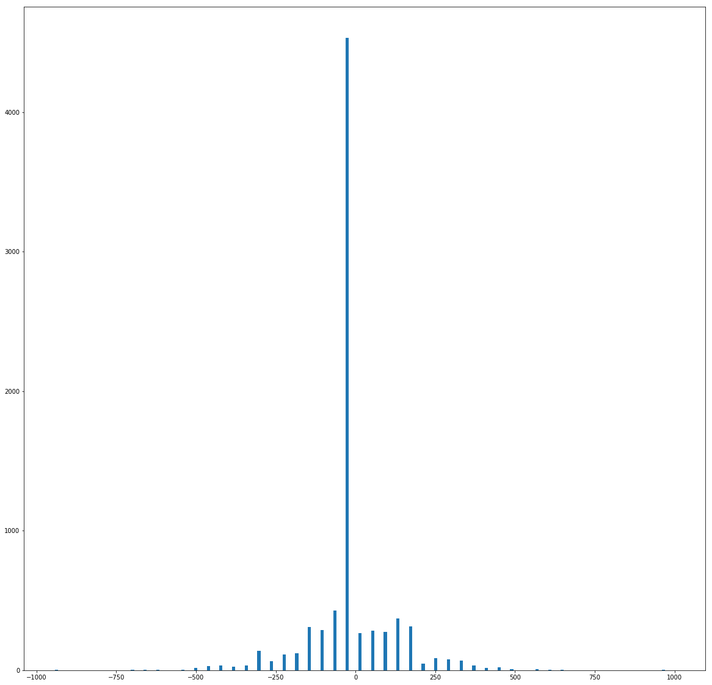
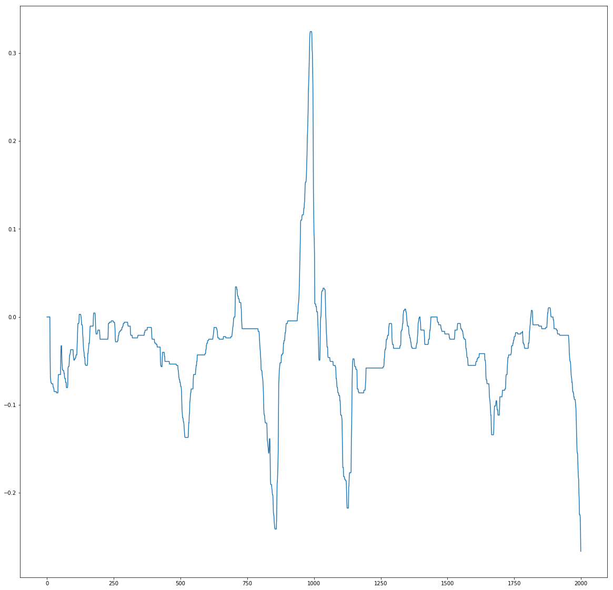
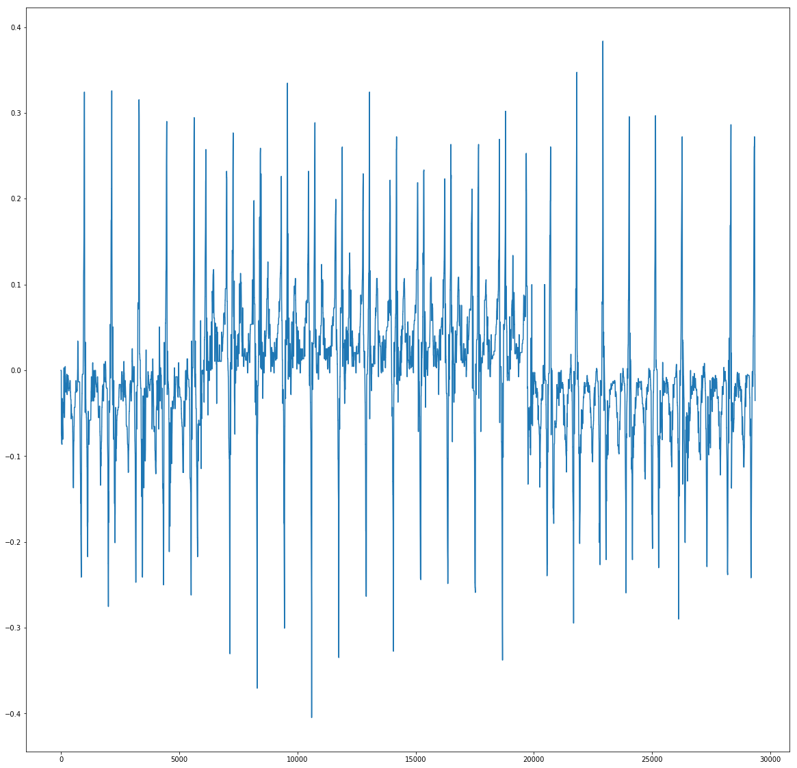
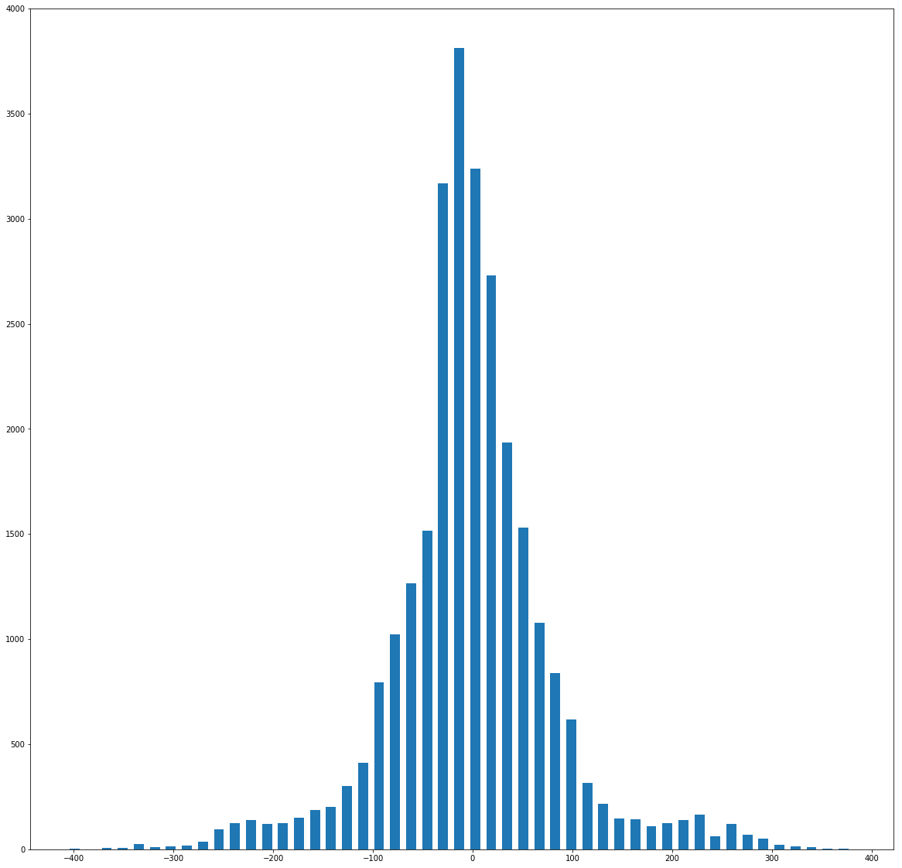

#**Behavioral Cloning** 

---

**Behavioral Cloning Project**

The goals / steps of this project are the following:
* Use the simulator to collect data of good driving behavior
* Build, a convolution neural network in Keras that predicts steering angles from images
* Train and validate the model with a training and validation set
* Test that the model successfully drives around track one without leaving the road
* Summarize the results with a written report

[//]: # (Image References)
Images from car "cameras".  
LEFT    
  
RIGHT  
  
CENTER  
  

## Repository
You can find here all elements of this project.   
Video - cloning.mp4 also at https://vimeo.com/225957146 (password: udacity)   
+ 2 other videos  
drive.py - modified version of drive.py    
readme.md - this project description    
models folder:  
        nvidia_ELU_3cameras_generator - model based on generator with 3 cameras and ELU activation  
        nvidia_RELU_based model  - model based on loading all data to memory, one camera, RELU activation  
        model.h5.7z - RELU trained model (packed into 7z archive due to github limitations)  
        ELU_model.h5.7z - ELU trained model (packed into 7z archive due to github limitations)  

## Good data approach 
I played with Udacity simulator couple of months before I was ready to try myself on SelfDrivingCar ND. To be honest driving with keyboard was really hard for me. Using mouse gave a little better results but still it looked more like drunk driving /first time driving. I decided to dig into code and find place to make easier to drive with mouse. After trying to limit steering angle, second idea was to make mouse much less sensitive - 4 times to be exact.   
You can do it in Assets/Standard Assets/Vehicles/Car/Scripts/Steering.cs by changing this line float mousePosition = Input.mousePosition.x; into this float mousePosition = Input.mousePosition.x / 4;

Using this hack allowed me to record pretty smooth data, a lot more like in real life, where at least most of the time, you change steering angle really in a slow continous way. It is still far from perfect but helped me building proper models.

### Data distribution / statistics 
To get more balanced data set - I drove car 10 laps one way, and 10 another (because regular lap is most of the time turning left). 10 laps helped generalize better - because my driving would never be the same, model learns kind of "average" way of driving on this track. I didn't add recovery from edges because it wasn't necessary to drive properly, but I added first sharp turn left couple of times because it was the weakest point in model behaviour.

#### Udacity provided data (probably recorded using keyboard) - around 8000 images.

#### My data - 27 000 images 

As you can see gradients in my data are much smoother (but could be better), those high spikes are those 3 tight turns - it is clearly visible whats happening. In provided data, it is really hard to say how many laps we have and what part of plot is what part of track. 
Histograms of the data shows also that driving with mouse is a lot more real-life like. You rarely have absolute zero angle on your steering wheel (due to road curvature, bumps, suspension, tyres etc).

### Data preparation / augmentation
I decided to test if i could teach my model using pure data with no augmentation (like brightness change / shifting etc) and using just one camera - I think video speaks for the results. The only thing I did was removing two "bad" laps of data that caused some wobbling after first hard turn. 
You can see it here with bad data:

Video - cloning_badlaps.mp4 also at https://vimeo.com/226096880 (password: udacity)  

Later I tested 3 cameras on ELU model, by adding/subtracting 0.2 from steering for left and right cameras. 

### Data balancing
During my initial tests, I trained my model on all data. But it always falled from the track during first sharp left turn. I decided to manually remove some of low steering angle (driving straight and almost straight) to 10%, and also doubled sharp turn images with steering value bigger than 0.12. Later I concatenated both selections and used them for training. It greatly helped with sharp turns.  

After my RELU model was driving properly I worked on ELU version but this one on the same data with the same balancing, didn't work properly. 
I decided to write generator with perfectly balanced batches. To do this, I split data into 32 steering "bins" for example - from 0.40 to 0.38, than 0.38 to 0.36 etc. 
Than I sampled 1 example from each bin to create balanced batch (same amount of each steering angle). You can see it in "Elu generator" file.   

After I run this model in simulator i got a litle bit funny "drunk but safe" driving:
elu_drunk_driving.mp4 also at https://vimeo.com/226856368 (password: udacity)  
I think this is due to "too much sharp turn" data in balanced set. 
This would mean that some kind of gaussian distribution of steering values would be much better. 

### Model Architecture and Training Strategy

#### 1. Architecture based on Nvidia model

My model consists of a convolution neural network with 5x5 and 3x3 filter sizes and depths between 24 and 64. 
The model includes RELU layers to introduce nonlinearity , and the data is normalized in the model using a Keras lambda layer. 
I also crop images inside the model, to avoid any issues with drive.py  

Model layers:  
Lambda (normalization)   
Cropping   

Convolutional (24 filters, filter size (5,5), strides=1, padding="valid")  
Activation ELU / RELU  
MaxPooling (2,2)  

Convolutional(36 filters, filter size (5,5), strides=1, padding="valid")  
Activation ELU / RELU  
MaxPooling (2,2)  

        
Convolutional(48 filters,  filter size (5,5), strides=1, padding="valid")  
Activation ELU / RELU  
MaxPooling (2,2)  

    
Convolutional(64 filters,  filter size (3,3), strides=1, padding="valid")  
Activation ELU / RELU  

    
Convolutional(64 filters, filter size (3,3), strides=1, padding="valid")  
Activation ELU / RELU  
     
Flatten  

Dense(1164))
Activation ELU / RELU  

Dense(100)
Activation ELU / RELU  

Dense(50)
Activation ELU / RELU  

Dense(10)
Activation ELU / RELU  
    
Dense(1, activation="linear") for ELU or 
Dense(1, activation="tanh") for RELU

#### 2. Models validation

Both (elu and relu) models were trained and validated on different data sets to ensure that the model was not overfitting. 
The models were tested by running it through the simulator and ensuring that the vehicle could stay on the track.

#### 3. Model parameter tuning

The model used an adam optimizer, so the learning rate was not tuned manually (model.py line 25). 
I tested different number of epochs usually ranging from 3 to 7.

#### 4. Summary

Overall it was interesing experience, sometimes a little bit contradictory to "common sense" - like for example to much turning data would make model turn even on a straight road.
I tried to avoid any unnecessary operations on images that could make it harder to predict, what is really going on inside the model. I chose "clean data" approach and it seems that it works. 
In many forum discussions, people mentioned changing image brightness and some translations, but first of all - it wasn't necessary. 
Second - I tried to move my head around during driving to simulate image shifts and my first reaction was - if you move image around, and white lines change their relative position, problably
you should change steering as well - so that would require again quite some time for testing different change values.

Also I lost lots of time during initial setup process - first because of decimal point . vs , that "messed up" drive.py and my data, and later - to make those model work on GPU, I had to create my own docker images. But later it was lots of fun with testing, driving under water etc. Lots of new ideas can be tested using this kind of tools before you apply them in a real car. 

