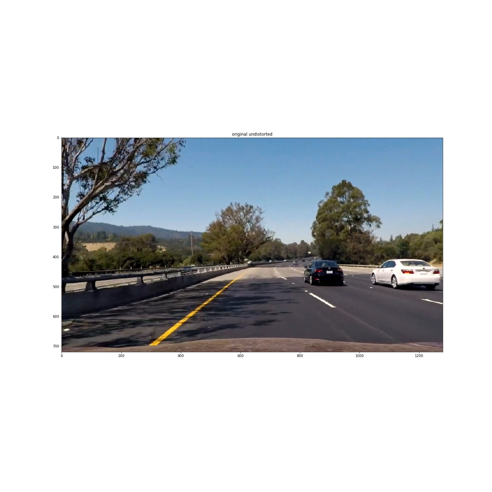

**Advanced Lane Finding Project**

Goal of this project was process previously recorded video and create a new video containing visual information about lane lines and road curvature.


### Pipeline (single images)

#### 1. Removing distortion from camera

The code for this step is contained in the IPython notebook "undistort.ipynb".  

1) I initialized 2 arrays for objpoints and imgpoints  
2) I find chessboard corners for all test images  
3) For all found corners i draw it on original images for "sanity check"  
4) Save objpoints and imgpoints  
5) Calibrate camera with calibrateCamera  
6) Create mtx/dist matrices that will be used for undistort function  
7) Save those matrices into files using np.save  
8) Later during pipeline i just load files with undistort matrices and apply them on each frame  

Original  
  

<br /><br />  

Original undistorted  
  


#### 2. Operations on image to get binary image.

I used a combination of color and gradient thresholds to generate a binary image.
1) I create all possible channels - I split RGB, HSV, HSL and LAB versions of the source image into separate arrays - function 'create_channels'.
2) I use function color_threshold on l channel(from hsl).
3) I create gradient_x version of original rgb image using abs_sobel_thresh function. Most of the time gradient_y was giving lots of noise and I decided not to use it.
4) Finally I use OR operation on step 2 and 3 to get kind of sum of those two thresholded images
5) To close/cleanup damaged lines and make them more solid, I use function cv.morphologyEx to perform operation called closing
6) To remove unwanted small noise I use function medianBlur that removes some small artifacts from thresholding

Threshold on h channel (from HSV)


Threshold on l channel (from HSL)


Gradient x (on original RGB image)


Combination of previous
gradient x (=1) AND threshold on h channel (=1) OR threshold on l channel (=0)


Morphological "closing"


Median Blur


#### 3. Perspective transform

I chose points based on couple of tests (what is the best source region / destination region)
- src are source points
- dst are destination points

Unwarped image (after median blur)


To change perspective of this image to top-view I use function warpPerspective and
hardcoded points:

```python

    src = np.float32([
                [600,450],         
                [700,450],
                [1100,720],        
                [200,720]
                 ])

    dst = np.float32([
                [200,-400],         
                [1100,-400],
                [1100,720],        
                [200,720]
                 ])
```

Warped image


I verified that my perspective transform was working as expected by drawing region based on `src` points and test image and changed its perspective to to verify that the lines appear parallel in the warped image.

Unwarped image with region of interest


Warped image - lines seem to by parallel


#### 4. Lane line pixels identification 
Next i used code from udacity materials (with some corrections/changes) to use sliding window approach for finding regions possibly containing lines. 
Function is called find_window_centroids and finds X coordinate of the center of region containg most white points. 
I use window 100x80 to avoid finding too small pieces but also to avoid to much generalization (big region would not be as accurate as small ones).
I draw those rectangle regions using function draw_centroids.

Found regions


To create touples containing x and y coordinates of the centers I use function centroids_to_points. 

This gives me points for fitting a line using polyfit - I store them in left_points and right_points variables.

Fitting is taking place in function fit_left_and_right. It returns A,B,C coefficients for the polynomial.

Then i draw lines based on those polynomials onto original warped image to see if they really fit and are good curvature approximation

Fitted lines


After fitting the lines, I can draw part of the road showing curvature.
Region of interest on the road


#### 5. Curvature

I did this in lines in function road_curvature that calculates this based on assumptions about pixel to meter conversion.

#### 6. Final step

In the final step I use AddWeighted function to plot road region onto original image.

Fitted lines


### Pipeline (video)

#### 1. Image processing

Same steps as for single images were used to detect lines / fit regions.

#### 2. Averaging the results

First attempts to create video without any averaging failed miserably on so called "bad frames" that contained some noise or too little information. 
My first idea was to average polyline coefficients but later i decided to work on raw data - points. 
When i tried simple averaging values for the same point overtime I got some improvement but outliers still caused some issues, but they weren't as clearly visible.
Then I found on stackoverflow small snippet of code that allows to use median to clean up your data. After some tweaking results got even better, but sometimes
my system reaction was kind of delayed. I figured out that when there was a sudden change in line position, median wasn't enough to "catch up". 
So i decided to add a final step - weighted average on data without outliers. This smoothened drawing even more. 


#### 3. Final video

Below you can find link to my project video:


---

### Discussion

During this project I learned to switch between different data types, scalling it from 0-1 to 0-255 back and forth. This was probably the most "annoying" point and at the beggining cost me some time.
My solution can definitely be improved by working on threshold automatic adaptation and image brightness/contrast correction. Without those changes, it just works on those conditions found in project_video samples.
Also removing polyfit outliers (points that make fitting on particular step worse) could help make this model more robust.

