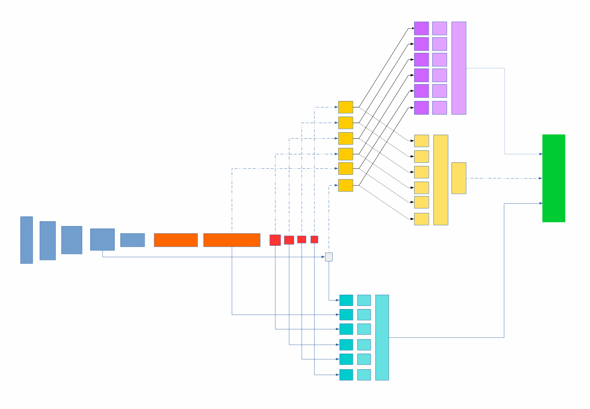

# Vehicle Detection Project - Neural Network Based - SSD #

The goals / steps of this project are the following:
- choosing method (deep learning vs hog/svm)
- detecting cars on video
- creating video with bounding boxes for detected cars

I decided to go with SSD (Single shot detection) which is much master than hog based solutions. 

Disclaimer: I started working on my solution with code from Pierluigi Ferrari who ported SSD from Caffe to Keras.
Gradually my model became a lot different than his base model but I used his decoding functions and anchor-box implementation. 
Also it took quite a lot of effort to train my model and tune hyperparameters to get a good detection even without averaging between frames.

### Basics of Single Shot Dectection. 

The main ideas behind SSD is to run whole computation in a single trainable model. 
So called classic solutions are often based on many steps that have to be tuned separately.
In SSD classes of objects, different scales and different aspect ratios are all calulated during single prediction.

### Original SSD model
Original model called often SSD300 consists of base model and prediction layers. 
Image that is commonly used to show "ssd" architecture is not doing a very good job in my opinion.
So I decided to draw my own based on Pierre's (and later mine) code. 

 

Base model is:
1) VGG feature extractor (light blue on the left)
2) model "compressing" (1x1 convolutions and dilated convolutions) - (orange part)
3) Getting out of model different level of details  - (red part)
4) Gray - normalizer

And from 3) and 4) we have 2 separate pipelines 
1) is detecting classes (softmax) - (light green/turqoise part)
   It contains inputs, reshape, concatenation of results and softmax.
2) is working on different scales - (purple part)
3) is working on different aspect ratios - (yellow part)

At the end of this model, those two pipelines are joined into single big tensor of predictions - green rectangle.

---
### Creating model
I started with very small network initially proposed by Pierluigi. 
It was good enough to detect some cars, and show me what i can expect from this kind of detections.

Next step was making it a lot deeper (more layers and more filters).
I did it in couple of steps, gradually getting better results.

My final working model is in <FILE>
I also tried to use VGG19 as feature extractor but training was horribly slow and I had to dump this idea.
After research about what network is as good and faster, I decided to integrate Resnet-like network into my model.

I used keras functions for creating resnet components and changed it a little bit to fit SSD model.
Looking back at the image with model schematics I replaced all light blue elements (previously VGG like) with new
Resnet like. 

Overall it was kind of fight between accuracy and available memory. 
Even 11GB on 1080 Ti is not that much if you work on larger models.

I also added more possible aspect ratios because first tests showed that model is having hard time to "fit" car nicely
into rectangle.

Model is stored in keras_resnet.py, and "Resnet-like SSD training.ipynb" is used to train it. 

### Decoding/thresholding

When I started to work on this I played a lot with two main parameters.

1) Confidence threshold that tells decode functions what predictions should we use as positive (above what value in range 0-1).
Default was 0.5 but it gave many false positives, so i increased it, until i was happy with results.
But sometimes for one object there was more than one overlapping positive prediction box. This is where second parameter comes.

2) Iou threshold was used as a threshold value in decode functions that helped to remove boxes that had "jaccard overlap" bigger than this value.
Jaccard overlap called also iou is calculated as intersection(overlapping part) / union (sum of both boxes). 
This overlap is very handy in terms of calculating how much boxes overlap but when you are thresholding, you will probably also want to remove boxes that overlap completely. This is why i added this condition to greedy nms functions. 

For totaly clear results I used:
confidence_thresh=0.95, iou_threshold=0.05,

but after fixing complete box overlapping i used
confidence_thres=0.8 and iou_threshold =0.3 - it gave a tiny bit of fake positives but my two main cars were correctly detected and other small cars
were also marked as cars. 

### Video Implementation

#### 1. Creating video
Video is created using <FILE> that simply creates model, loads weights and then procesess video. 
Each frame is scaled down to model size - 480x300 and then predictions are rescaled to original image.
A little bit like in U networks. I added time of processing each frame and its number to "debug" my solution.

#### 2. Final video

You can see my final result at
  
or here
https://www.youtube.com/watch?v=Wdt4Z5uYHiU&feature=youtu.be

### Discussion

#### 1. Ideas for improvement

Next step would be testing how many layers we can remove from this model to make it fast/lightweight. 
With lighter model we could test higher resolution images without resizing (and losing information). 

Also some work could be done on NMS functions. Because at this point sometimes the box with best confidence is not the best fit for a car.
On PyimageSearch.com I found method by dr Malisiewicz, that is using box area to make better NMS.
http://www.pyimagesearch.com/2015/02/16/faster-non-maximum-suppression-python/

#### 2. Failures
Definitely this model with very little data to train is not very generalized. I tested detecting car at night and it was a complete failure.
Also not every position of the car is detected equally. When camera sees left/right side of the car and very little front/back, very often it fails. This is all due to very little data and this data is also not very diverse. 
You can see this here:
https://www.youtube.com/watch?v=OuKWjsj3UQQ&feature=youtu.be

