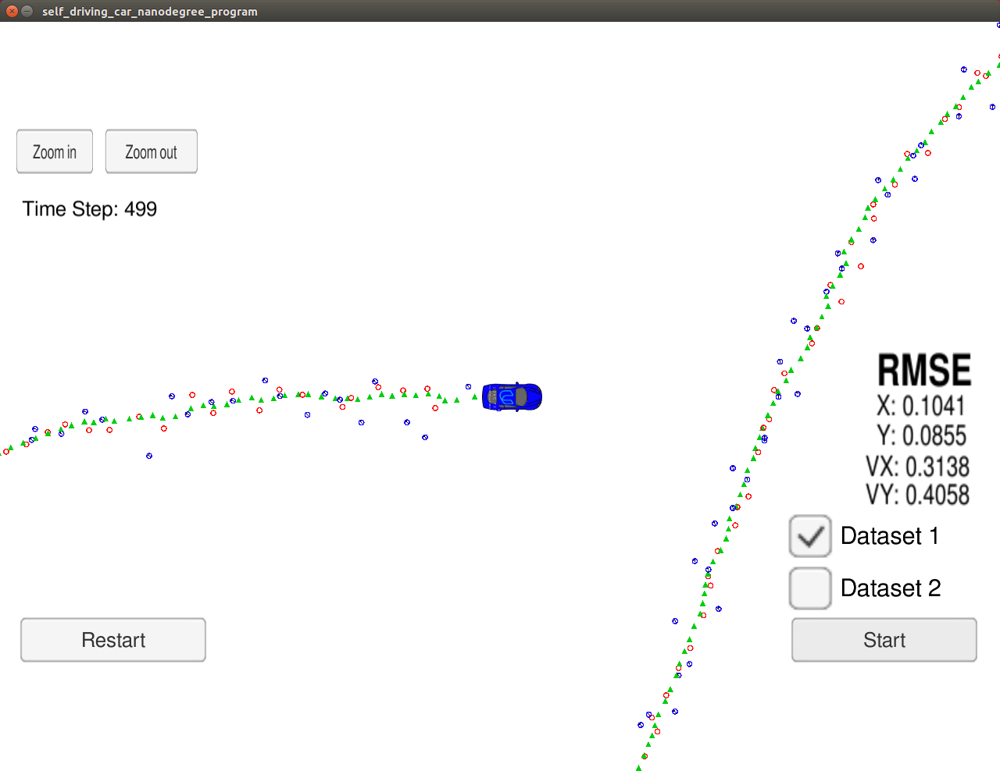

## Extended Kalman Filter Project

### How to run:
cmake CMakeLists.txt  
make  
./ExtendedKF  

### Results:
My final RMSE results:  
  

You can see it running here:  
https://vimeo.com/239303625  

### Comments:
1) Step was fixing issues with localisation - when i switched to US locale, simulator started working.  
This is probably something that could be fixed inside the simulator to avoid unnecessary time loss / confusion.  

2) I easily found some parts of necessary code in the lessons but got stuck on some.   
Project overview video by D.Brown helped here to get most of the pieces.   

3) Last part was debugging / fixing. The last issue i had (like many students on the forum) was angle normalization.  
I tested couple of methods - with "fmod", "while" and finally decided to use atan2 with additional adjustments.  

 
