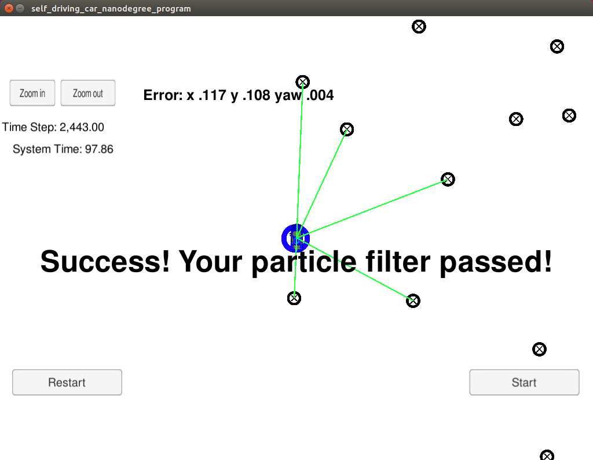

## Particle Filter Project

### How to run:
cmake CMakeLists.txt  
make  
./particle_filter  

### Results:
My final Particle Filter results:  
  

You can see it running here:  
https://vimeo.com/242871434  
password: udacity  

### Comments:
1) At first I used parts from lessons. 

2) Project overview video helped here to get weight update structure and fix minor issues with code.   

3) Unfortunatelly weights of my particles were always going down to zero.
On forum I was pointed to idea of creating "debug mode" without adding noise
to particles.  
I found that one of the variables in prediction was not initialised properly.   

4) The last part was picking good particles number.  
At first I started with 1 particle during debug process. I thought i will need at least 1000.  
But it was too slow and 100 worked great.  

 
 
