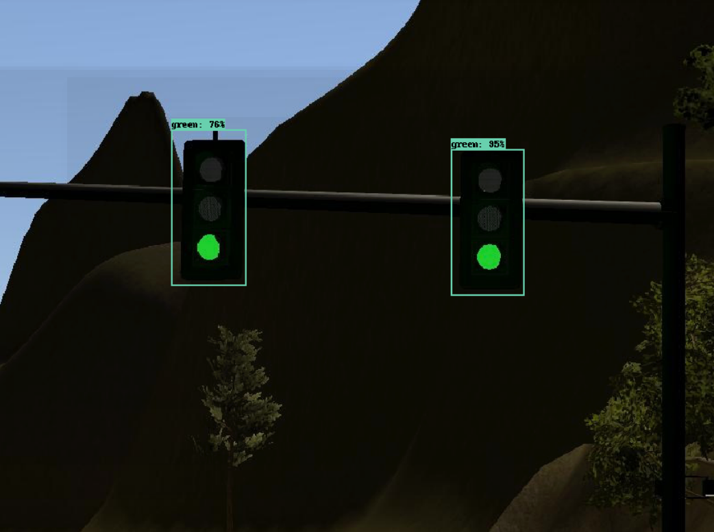

# Travelers

It is `Travelers` team repository for the capstone project of Udacity's Self-Driving Car Engineer Nanodegree. The team members are:
  - Volodymyr Ivanov <Volodymyr.Ivanov@gmail.com>
  - Michal Dulemba <photocoffeeman@gmail.com>
  - Alex Rodov <alex.rodov@gmail.com>
  - Anmol Sidhu <anmolsidhu@gmail.com>
  - Kulandaivelu Giridharan <giridharan4892@gmail.com>

## Project implementation
### Waypoint updater
The Waypoint Updater receives a sequence of the base waypoints and gets the sub-sequence of 200 waypoints ahead, based on evaluation closest point ahead a car.
If no traffic light with red signal detection occurs, the speed of car is defined as configured in ROS parameters (40 kph by default).
If traffic light with red signal is detected, the speed of car is reduced with configured deceleration and applying a special distance buffer to stop a car before traffic light.

### Traffic Light Detection
In project were implemented two approaches.

#### Computer Vision
Using Hue/Saturation/Value (HSV) color space <https://en.wikipedia.org/wiki/HSL_and_HSV> which works well for base colors (red/blue/green)
<https://docs.opencv.org/3.1.0/da/d53/tutorial_py_houghcircles.html>
<http://opencv-python-tutroals.readthedocs.io/en/latest/py_tutorials/py_imgproc/py_colorspaces/py_colorspaces.html>

For red color use bright red and magenta red, for green - base green.

#### Deep Learning
For learning is used `ssd_mobilenet_v1_coco_2017_11_17` neural network and during training process more than 1500 images were labeled using <https://pythonprogramming.net/training-custom-objects-tensorflow-object-detection-api-tutorial/> to convert labeled images (image and xml file with label) into tensor flow records.

Samples of images:

All related to deep learning approach data including training set, stored model and classifier is placed [here](https://github.com/VolodymyrIvanov/Udacity-Capstone/tree/master/ros/src/tl_detector/light_classification)
